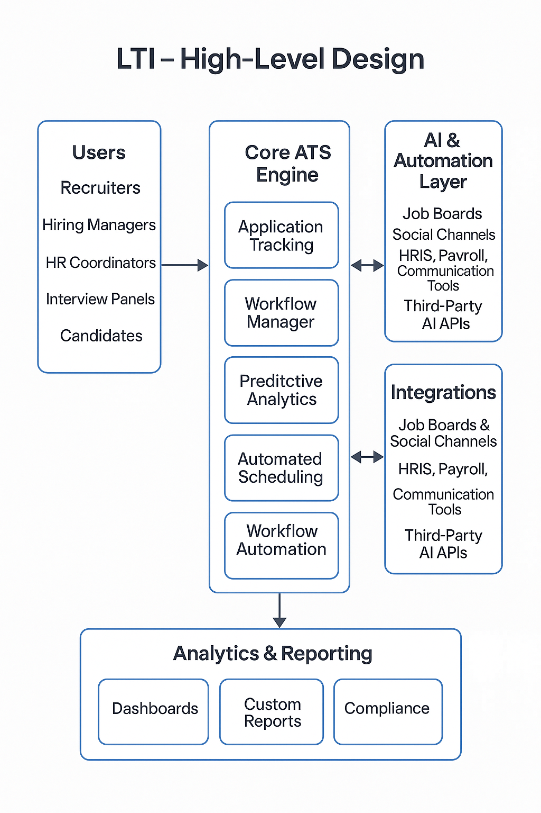
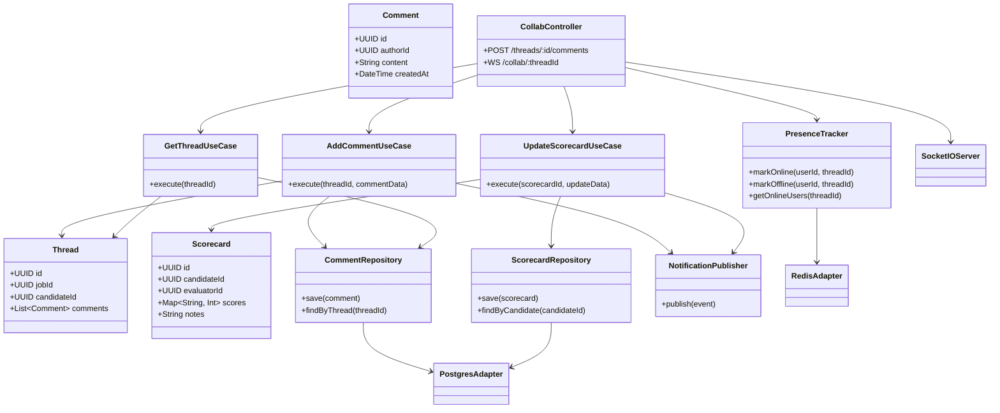

# LTI - Next-Generation Application Tracking System

## Overview

**LTI** is an advanced Application Tracking System (ATS) designed to transform and streamline the entire recruitment lifecycle for modern organizations. Built with cutting-edge technology and an AI-first mindset, LTI empowers HR departments, recruiters, and hiring managers to work smarter, faster, and more collaboratively than ever before.

## Key Objectives

- **Increase HR Department Efficiency:**  
  Automate repetitive tasks, reduce time-to-hire, and minimize manual effort through intelligent workflows and smart scheduling.

- **Enable Real-Time Collaboration:**  
  Facilitate seamless communication and decision-making between recruiters, hiring managers, and stakeholders with shared dashboards, live updates, and collaborative evaluation tools.

- **Powerful Automations:**  
  Automate candidate sourcing, CV screening, interview scheduling, feedback collection, and follow-ups — freeing HR professionals to focus on strategic hiring.

- **AI Assistance at Every Step:**  
  Leverage AI to match candidates to job descriptions, suggest top talent, predict hiring outcomes, and provide actionable insights for better hiring decisions.

## Aggregated Value

**LTI** consolidates recruitment data, processes, and communication into a single intelligent platform. It delivers:

- **Faster time-to-hire**
- **Higher-quality talent pipelines**
- **Lower administrative overhead**
- **Improved candidate experience**
- **Data-driven hiring decisions**

This results in significant cost savings, a more agile HR function, and a competitive edge in talent acquisition.

## Competitive Advantages

✅ **AI-Driven Smart Matching:**  
Find the best-fit candidates automatically with AI-powered ranking and recommendations.

✅ **Real-Time Collaborative Hub:**  
Keep all stakeholders aligned with shared candidate notes, scorecards, and live status tracking.

✅ **Customizable Workflows:**  
Adapt LTI to unique recruitment processes and company policies without extra development.

✅ **Advanced Analytics & Reporting:**  
Access actionable insights and predictive analytics to continuously improve hiring strategies.

✅ **Seamless Integrations:**  
Plug and play with existing HR tools, job boards, and communication channels.

✅ **Candidate-Centric Experience:**  
Engage top talent with timely communication, branded portals, and mobile-friendly interfaces.

## Conclusion

With **LTI**, organizations gain a future-ready ATS that not only manages applications but actively enhances every aspect of hiring. By combining automation, collaboration, and AI-driven intelligence, LTI positions companies to attract, engage, and hire the best talent faster and more effectively than the competition.

**Let’s redefine recruitment efficiency together with LTI.**

---

# LTI - Main Functionalities

## 1️⃣ Automated Job Posting

- Publish open positions to multiple job boards and social media with a single click.
- Use templates for quick job description creation.

## 2️⃣ Smart Candidate Sourcing

- Source candidates from integrated databases, job boards, and social channels.
- Use AI to identify passive candidates who match open roles.

## 3️⃣ AI-Powered Resume Screening

- Automatically parse and rank resumes based on skills, experience, and job fit.
- Highlight top candidates and flag missing qualifications.

## 4️⃣ Collaborative Candidate Evaluation

- Centralized dashboard for recruiters and managers to view candidate progress.
- Shared notes, interview scorecards, and evaluation forms.
- Real-time notifications and status updates.

## 5️⃣ Automated Interview Scheduling

- Sync with calendars to propose and book interview slots automatically.
- Send confirmations and reminders to candidates and interviewers.

## 6️⃣ Workflow Automation

- Automate routine tasks like sending follow-up emails, rejection letters, or status updates.
- Customizable pipelines for different job types or departments.

## 7️⃣ AI-Assisted Recommendations

- Suggest best-fit candidates for new roles based on hiring history and skill gaps.
- Predict likelihood of hire and cultural fit.

## 8️⃣ Advanced Reporting & Analytics

- Track key metrics: time-to-fill, cost-per-hire, source effectiveness, diversity data.
- Visual dashboards and exportable reports for management insights.

## 9️⃣ Candidate Relationship Management (CRM)

- Build and nurture talent pools for future openings.
- Engage passive candidates with automated campaigns and personalized communication.

## 🔟 Integration & Security

- Integrate seamlessly with HRIS, payroll, and communication tools.
- Ensure data privacy and compliance with GDPR and other standards.

---

# LTI - Lean Canvas


## Problem

- Repetitive job posting
- Difficulty finding qualified candidates
- Time-consuming resume screening
- Lack of coordination in candidate evaluations

## Customer Segments

- Human Resources departments
- Recruiters
- Hiring Managers

## Unique Value Proposition

A next-generation ATS that boosts recruitment efficiency through **automation**, **AI**, and **real-time collaboration**.

## Solution

- Automated job posting
- AI-powered candidate sourcing
- AI-driven resume screening
- Automated scheduling and follow-ups
- Collaborative evaluation tools

## Channels

- Direct sales
- HR technology partnerships
- Online marketing and product demos

## Revenue Streams

- Subscription fees (SaaS)
- Tiered pricing plans
- Add-ons for advanced AI modules

## Cost Structure

- Platform development and maintenance
- AI model training and data updates
- Customer support and onboarding
- Marketing and sales expenses

## Key Metrics

- Time-to-hire
- Quality of hire
- Candidate pipeline growth
- Diversity of hires
- User engagement

## Key Activities

- Sourcing and attracting candidates
- Screening and evaluating applications
- Scheduling and conducting interviews
- Automating communication and feedback
- Generating analytics and reports

## Customer Relationships

- Training and onboarding
- Dedicated support
- Community engagement
- Continuous product updates

---

# 🎯 LTI — Top 3 Main Use Cases

---

## 1️⃣ AI-Powered Resume Screening & Matching


**Who uses it:**

- Recruiters
- HR Coordinators

**What happens:**

- LTI automatically parses incoming resumes.
- The AI ranks and shortlists candidates based on job requirements, skills, and experience.
- Best-fit candidates are flagged; mismatches are highlighted for easy filtering.

**Value:**

- Significantly reduces manual screening time.
- Ensures higher quality shortlists.
- Handles large application volumes with speed and accuracy.

## 2️⃣ Collaborative Candidate Evaluation


**Who uses it:**

- Recruiters
- Hiring Managers
- Interview Panels

**What happens:**

- All evaluators share candidate notes, interview scorecards, and feedback in a single, real-time dashboard.
- Stakeholders receive live status updates on candidate progress.
- Decisions and approvals happen faster with shared context.

**Value:**

- Speeds up hiring decisions.
- Improves alignment and reduces miscommunication.
- Creates a fair, structured, and consistent evaluation process.

## 3️⃣ Automated Interview Scheduling


**Who uses it:**

- Recruiters
- Candidates
- Hiring Managers

**What happens:**

- LTI syncs with interviewers’ calendars.
- Candidates choose from available time slots.
- The system confirms, reschedules if needed, and sends automatic reminders to all parties.

**Value:**

- Eliminates manual scheduling back-and-forth.
- Reduces interview no-shows and conflicts.
- Enhances candidate experience with smooth, timely communication.

---

# LTI Data Model - Entities and Attributes (Tables)


## User

| Attribute | Type                                                                         | Description       |
| --------- | ---------------------------------------------------------------------------- | ----------------- |
| `user_id` | UUID                                                                         | Unique identifier |
| `name`    | String                                                                       | Full name         |
| `email`   | String                                                                       | Email address     |
| `role`    | Enum (Recruiter, HR Coordinator, Hiring Manager, Interview Panel, Candidate) | User role         |
| `phone`   | String                                                                       | Phone number      |
| `status`  | Enum (Active, Inactive)                                                      | Current status    |

## Candidate

| Attribute        | Type                                                                | Description                |
| ---------------- | ------------------------------------------------------------------- | -------------------------- |
| `candidate_id`   | UUID                                                                | Unique identifier          |
| `name`           | String                                                              | Full name                  |
| `email`          | String                                                              | Email address              |
| `phone`          | String                                                              | Phone number               |
| `resume`         | File                                                                | Uploaded resume            |
| `status`         | Enum (Applied, Shortlisted, Interviewing, Offered, Hired, Rejected) | Application stage          |
| `profile_notes`  | Text                                                                | Recruiter/manager notes    |
| `rank`           | Integer                                                             | Candidate ranking          |
| `highlight_flag` | Boolean                                                             | Flag for special attention |

## Job

| Attribute     | Type                         | Description        |
| ------------- | ---------------------------- | ------------------ |
| `job_id`      | UUID                         | Unique identifier  |
| `title`       | String                       | Job title          |
| `department`  | String                       | Department name    |
| `location`    | String                       | Job location       |
| `description` | Text                         | Job description    |
| `status`      | Enum (Open, Closed, On Hold) | Current job status |
| `created_by`  | FK (User)                    | Creator            |

## Interview

| Attribute        | Type                                                | Description         |
| ---------------- | --------------------------------------------------- | ------------------- |
| `interview_id`   | UUID                                                | Unique identifier   |
| `candidate_id`   | FK (Candidate)                                      | Related candidate   |
| `job_id`         | FK (Job)                                            | Related job         |
| `panel_id`       | FK (Interview Panel)                                | Assigned panel      |
| `scheduled_time` | DateTime                                            | Scheduled time      |
| `status`         | Enum (Scheduled, Rescheduled, Completed, Cancelled) | Status              |
| `scorecard`      | JSON                                                | Feedback and scores |

## Interview Panel

| Attribute  | Type        | Description       |
| ---------- | ----------- | ----------------- |
| `panel_id` | UUID        | Unique identifier |
| `members`  | [FK (User)] | Panel members     |
| `comments` | Text        | Panel comments    |

## Calendar

| Attribute      | Type      | Description       |
| -------------- | --------- | ----------------- |
| `calendar_id`  | UUID      | Unique identifier |
| `user_id`      | FK (User) | Owner             |
| `availability` | JSON      | Available slots   |
| `synced`       | Boolean   | Sync status       |

## Notification

| Attribute         | Type                       | Description          |
| ----------------- | -------------------------- | -------------------- |
| `notification_id` | UUID                       | Unique identifier    |
| `recipient_id`    | FK (User)                  | Recipient            |
| `message`         | Text                       | Notification content |
| `status`          | Enum (Sent, Read, Pending) | Delivery status      |
| `created_at`      | DateTime                   | Creation timestamp   |

## Collaboration (Thread)

| Attribute      | Type           | Description         |
| -------------- | -------------- | ------------------- |
| `collab_id`    | UUID           | Unique identifier   |
| `candidate_id` | FK (Candidate) | Related candidate   |
| `job_id`       | FK (Job)       | Related job         |
| `comments`     | Text           | Collaboration notes |
| `shared_with`  | [FK (User)]    | Shared with users   |
| `created_at`   | DateTime       | Timestamp           |


# LTI - High Level Design

Users ↔ Core Engine ↔ AI & Automation ↔ Integrations ↔ Reporting

Everything is modular, API-driven, and designed for secure collaboration and data-driven recruitment.



# LTI - C4 Diagram

Focusing on the Collaboration Service, which handles real-time collaboration features like threads, scorecards, presence, and notifications.

## C1 - Context Diagram

Shows who interacts with LTI and how it fits into the broader environment.


```mermaid
graph TD
    Recruiter --> LTI["LTI]
    HiringManager --> LTI
    InterviewPanel --> LTI
    Candidate --> LTI

    LTI --> JobBoards["Job Boards & Social Platforms"]
    LTI --> Calendar["Calendar Services"]
    LTI --> HRIS["HRIS / Payroll System"]
    LTI --> EmailSystem["Email / Messaging System"]
```

## C2 - Container Diagram

Sshows how LTI is broken down into deployable, logical containers like web apps, services, databases, external integrations, and how they interact.


## C3 - Component Diagram for Collaboration Service

Shows how the internal components of the Collaboration Service handle real-time threads, scorecards, presence, and notifications.


## C4 - Code-Level Diagram

Shows the key classes/modules, their responsibilities, and how they collaborate inside the Collaboration Service.



